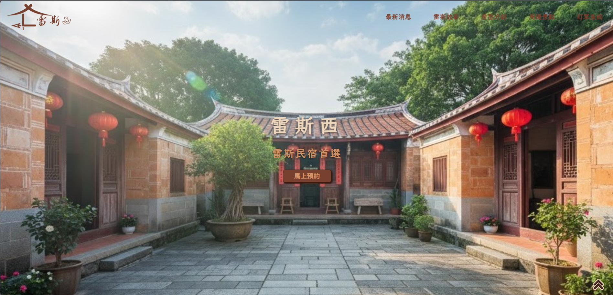
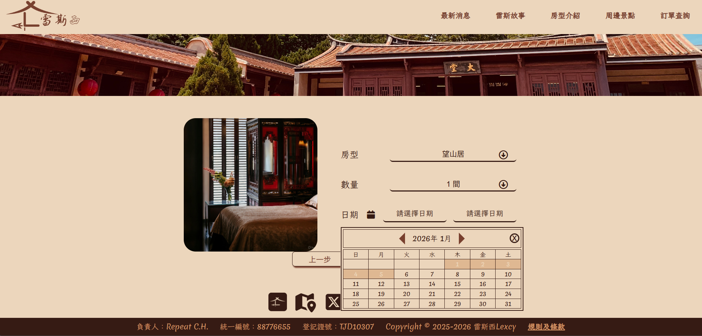
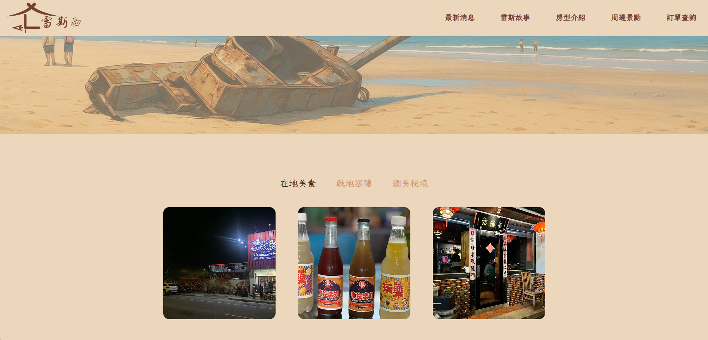
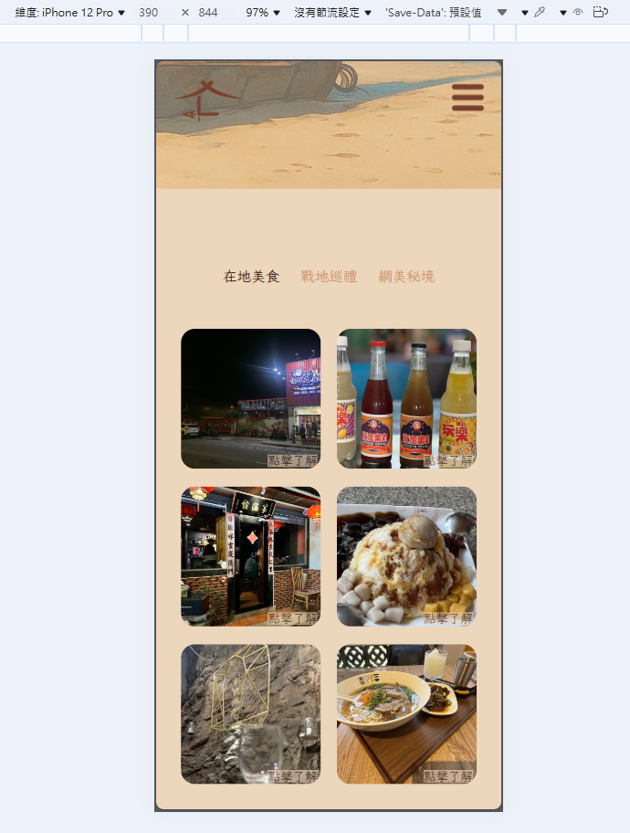

# Lexcy BnB (雷斯西民宿) Official Website

  

> **"Get away from the hustle and bustle."**
> 一個結合金門烈嶼戰地文化與閩式老宅溫度的旅宿品牌官網。

## 專案介紹

**Lexcy (雷斯西)** 是一個以金門烈嶼（小金門）為背景的虛擬民宿品牌網站。
有別於澎湖的熱鬧水上活動，金門擁有獨特的戰地風情與歷史建築聚落。本專案旨在透過網頁設計，推廣「老宅民宿」的慢活體驗，吸引嚮往遠離塵囂的旅客。

**品牌命名由來：**
* **Lexcy  (雷斯)**：源自「烈嶼」的台語發音。
* **cy (西)**：代表民宿位於烈嶼的「西方」聚落，同時英文發音近似 "Legacy"（傳承），象徵老宅文化的延續。

## 核心功能 (Key Features)

本專案實作了完整的民宿預約流程與品牌形象展示：

* **沉浸式首頁**：結合金門老宅視覺，傳遞「慢活」的品牌氛圍。
* **房型瀏覽與預訂**：
    * 展示「梅之間」、「望山居」、「聽濤閣」等特色房型。
    * 實作日期選擇、房數計算與價格試算邏輯。
* **訂單查詢系統**：使用者可透過 Email 與訂單編號查詢預訂狀態。
* **周邊景點導覽**：整合 Google Map 概念，介紹金門在地美食（如俊輝燒烤）與文化景點（如燕南書院）。
* **全裝置響應式 (Fully RWD)**：針對四種斷點進行細緻佈局調整，確保從手機到桌機的流暢體驗。

## 設計規範 (Design System)

本專案嚴格遵循自行制定的 Design Guideline，以呈現溫潤沈穩的視覺風格：

* **色彩計畫 (Color Palette)**：
    * **Primary**：`#78402E` (老宅紅磚), `#361B14` (沈穩木質), `#D19566` (夕陽餘暉)
    * **Secondary**：`#DFB892`, `#ECD6BC`
    * **Alert**：`#FF0000` (用於表單錯誤提示)
* **字體 (Typography)**：
    * English: **Merienda** (帶有手寫感的襯線體，呼應休閒氛圍)
    * Chinese: **LXGW WenKai Mono TC** (霞鶩文楷，展現人文氣息)

## 技術架構 (Tech Stack)

* **Frontend Core**: HTML5, CSS3, JavaScript (ES6+)
* **Layout Strategy**: Flexbox & Grid System
* **RWD Breakpoints**:
    * `1200px`: Large Desktop
    * `992px`: Tablet Landscape
    * `768px`: Tablet Portrait / Mobile Landscape
    * `576px`: Mobile Portrait

## 未來規劃 (Roadmap)

目前專案正進行 **Vue.js 3.0** 重構計畫，預計導入以下技術：
- [ ] **Componentization**: 將 Header, Footer, RoomCard, NewsCard,按鈕 等拆分為獨立組件。
- [ ] **State Management**: 使用 Pinia 管理訂房狀態。
- [ ] **API Integration**: 模擬後端 API 進行動態房況查詢。

## 📸 畫面展示 (Screenshots)

| 首頁 (Home) | 房型預訂 (Booking) |
|:---:|:---:|
|  |  |

| 景點介紹 (Attractions) | 手機版呈現 (Mobile) |
|:---:|:---:|
|  |  |

## 作者與聲明 (Credits)

* **Developer**: 陳從富 (Repeat C.H.)
* **Assets Source**:
    * 圖片來源：自行拍攝、AI 生成工具、金門縣政府觀光處。
    * 參考案例：JINBO, AgolaPlace, 池袋之家。

---
*Copyright © 2025-2026 Lexcy BnB. All Rights Reserved.*
